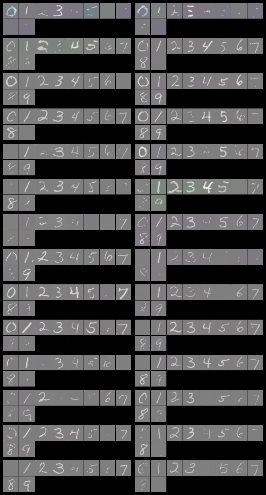

# Diffusion Models (DDPM) Project

## Overview

This project implements the Denoising Diffusion Probabilistic Models (DDPM) as proposed in the 2020 research paper. The project covers both unconditional and conditional DDPMs and includes training on various datasets such as MNIST, CIFAR, Fashion MNIST, face dataset, and car dataset. The conditional DDPM utilizes labels as conditions.

## Key Features

- **Unconditional DDPM**: Trained on various datasets without any conditional labels.
- **Conditional DDPM**: Uses labels as conditions to guide the diffusion process.
- **Noise Scheduling**: Implemented both linear and cosine noise schedulers for better results.
- **UNet Architecture**: Utilized in the backward diffusion process for denoising.
- **Training Results**: Saved and documented training results for various datasets.

## Project Structure

- `DDPM_Unconditional.ipynb`: Notebook for training and evaluating unconditional DDPM on various datasets.
- `ddpm_conditional_mnsit.ipynb`: Notebook for training and evaluating conditional DDPM on the MNIST dataset.
- `forward_visualisation.ipynb`: Notebook visualizing the forward diffusion process.

## Diffusion Process

### Forward Diffusion

In the forward diffusion process, noise is added to the image over several steps using a noise scheduler. This transforms the image into pure noise.

### Backward Diffusion

In the backward diffusion process, the model learns to reverse the noise addition, gradually denoising the image back to its original form. This is where the UNet architecture is utilized.

### Noise Schedulers

- **Linear Scheduler**: Adds noise linearly across the steps.
- **Cosine Scheduler**: Improves results by adding noise in a cosine manner.

Forward Diffusion Process using linear scheduler(Noising the images):


Forward Diffusion Process using cosine scheduler(Noising the images) - **improved results**:


## UNet for DDPM

The UNet architecture is crucial in the backward diffusion process. It consists of:

- **Encoder**: Downsamples the image to capture context.
- **Bottleneck**: Processes the condensed information.
- **Decoder**: Upsamples the image to reconstruct it from noise.

The skip connections in UNet help preserve spatial information, making it effective for image generation tasks.

## Results

All training results, including images and model checkpoints, are saved and available for review.

Some training results on MNSIT dataset with DDPM Conditional - left : Without EMA , Right : With EMA over few iterations:




## Usage

To run the notebooks and train the models, follow these steps:

1. Clone the repository:
   ```bash
   git clone <repository_url>
   cd <repository_name>

2. Install the required depenndencies
   pip install -r requirements.txt

3.Run Jupyter Notebook
  jupyter notebook

4. Open and execute the desired notebook (DDPM_Unconditional.ipynb, ddpm_conditional_mnsit.ipynb, or forward_visualisation.ipynb)
   and train the models using your own dataset.

## Contributions

Feel free to contribute to this project by submitting pull requests or opening issues. For major changes, please open an issue first to discuss what you would like to change.


